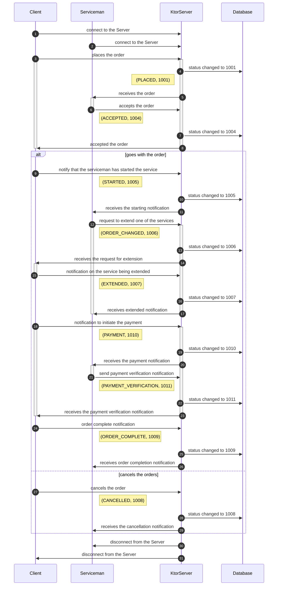
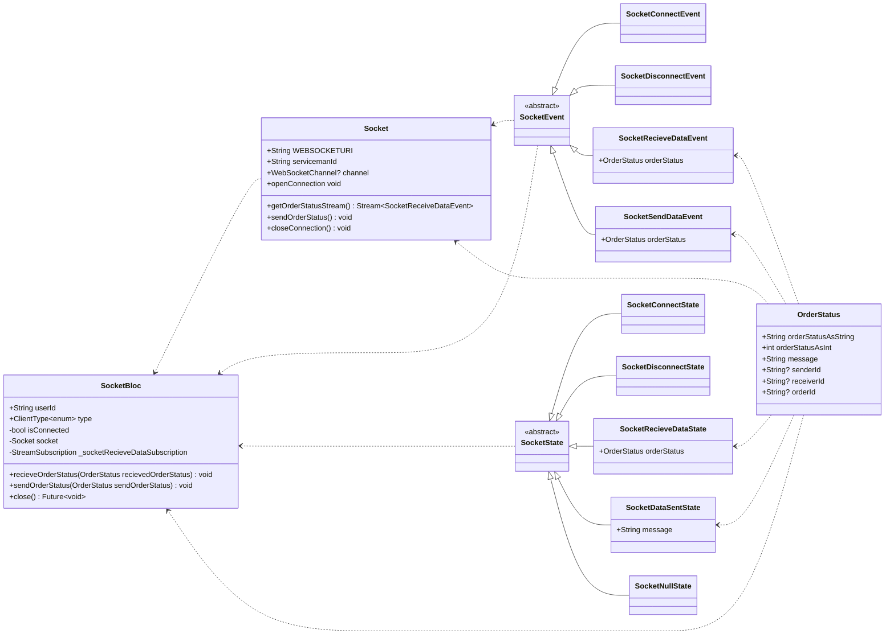

# socket_connectivity

The sequence flow of an entire order

```mermaid
sequenceDiagram
    autonumber
    participant C as Client
    participant S as Serviceman
    participant K as KtorServer
    participant D as Database
    
    C ->> K : connect to the Server
    S ->> K : connect to the Server

    C ->> K : places the order
    activate C
    activate K
    K ->> D : status changed to 1001
    Note left of K: (PLACED, 1001)
    K ->> S : receives the order
    activate S
    S ->> K : accepts the order
    deactivate S
    Note right of S: (ACCEPTED, 1004)
    K ->> D : status changed to 1004 
    K ->> C : accepted the order
    deactivate K
    deactivate C

    alt goes with the order
        C ->> K : notify that the serviceman has started the service
        Note right of S: (STARTED, 1005)
        K ->> D : status changed to 1005 
        K ->> S : receives the starting notification

        S ->> K : request to extend one of the services
        activate S
        activate K
        Note right of S: (ORDER_CHANGED, 1006)
        K ->> D : status changed to 1006 
        
        K ->> C : receives the request for extension
        activate C
        C ->> K : notification on the service being extended
        
        deactivate C
        Note right of S: (EXTENDED, 1007)
        K ->> D : status changed to 1007
        K ->> S : receives extended notification
        deactivate S
        deactivate K

        C ->> K : notification to initiate the payment
        activate C
        activate K
        Note right of S: (PAYMENT, 1010)
        K ->> D : status changed to 1010
        K ->> S : receives the payment notification
        activate S
        

        S ->> K : send payment verification notification
        
        deactivate S
        Note right of S: (PAYMENT_VERIFICATION, 1011)
        K ->> D : status changed to 1011
        K ->> C : receives the payment verification notification
        deactivate C
        deactivate K

        C ->> K : order complete notification
        Note right of S: (ORDER_COMPLETE, 1009)
        K ->> D : status changed to 1009
        K ->> S : receives order completion notification


    else cancels the orders
        C ->> K : cancels the order
        Note right of S: (CANCELLED, 1008)
        K ->> D : status changed to 1008
        K ->> S : receives the cancellation notification
    end


    K ->> S : disconnect from the Server
    K ->> C : disconnect from the Server

```

### The class diagram of the socket connectivity

```mermaid
classDiagram
    direction RL
    class SocketBloc {
        +String userId
        +ClientType~enum~ type
        -bool isConnected
        -Socket socket
        -StreamSubscription _socketRecieveDataSubscription
        +recieveOrderStatus(OrderStatus recievedOrderStatus) void
        +sendOrderStatus(OrderStatus sendOrderStatus) void
        +close() Future~void~
    }

    class Socket {
        +String WEBSOCKETURI
        +String servicemanId
        +WebSocketChannel? channel
        +openConnection void
        +getOrderStatusStream() Stream~SocketReceiveDataEvent~
        +sendOrderStatus() void
        +closeConnection() void
    }
    Socket ..> SocketBloc

    class SocketEvent{
        <<abstract>>
    }

    SocketConnectEvent --|> SocketEvent
    SocketDisconnectEvent --|> SocketEvent
    class SocketRecieveDataEvent {
        +OrderStatus orderStatus
    }
    SocketRecieveDataEvent --|> SocketEvent
    class SocketSendDataEvent {
        +OrderStatus orderStatus
    }
    SocketSendDataEvent --|> SocketEvent

    class SocketState{
        <<abstract>>
    }

    SocketConnectState --|> SocketState
    SocketDisconnectState --|> SocketState
    class SocketRecieveDataState {
        +OrderStatus orderStatus
    }
    SocketRecieveDataState --|> SocketState
    class SocketDataSentState {
        +String message
    }
    SocketDataSentState --|> SocketState
    SocketNullState --|> SocketState

    SocketEvent ..> SocketBloc
    SocketState ..> SocketBloc
    SocketEvent ..> Socket

    class OrderStatus {
        +String orderStatusAsString
        +int orderStatusAsInt
        +String message
        +String? senderId
        +String? receiverId
        +String? orderId
    }

    OrderStatus ..> SocketRecieveDataEvent
    OrderStatus ..> SocketSendDataEvent
    OrderStatus ..> SocketRecieveDataState
    OrderStatus ..> SocketDataSentState
    OrderStatus ..> SocketBloc
    OrderStatus ..> Socket
```